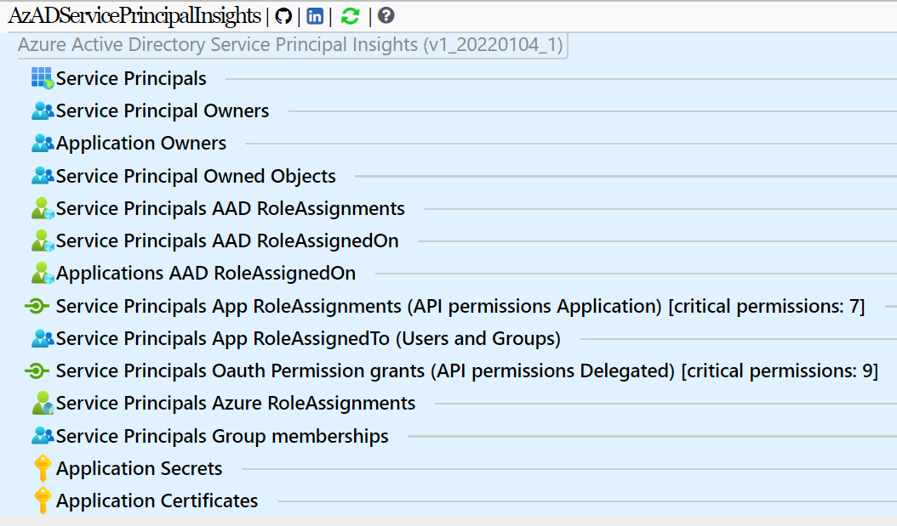

__AzADServicePrincipalInsights__

Insights and change tracking on Azure Active Directory Service Principals (Enterprise Applications and Applications)

# Features

* HTML export
* JSON export
* CSV export (wip)
* Customizable permission classification (permissionClassification.json)

# Data

* ServicePrincipals by type
* ServicePrincipal  owners
* Application owners
* ServicePrincipal owned objects
* ServicePrincipal  AAD Role assignments
* ServicePrincipal AAD Role assignedOn
* Application AAD Role assignedOn
* App Role assignments (API permissions Application)
* App Roles assignedTo (Users and Groups)
* Oauth permission grants (API permissions delegated)
* Azure Role assignments (Azure Resources; Management Groups, Subscriptions, Resource Groups, Resources)
* ServicePrincipal Group memberships
* Application Secrets
* Application Certificates

# Prerequisites

## Permissions

### Azure

Management Group (Tenant Root Management Group) RBAC: __Reader__

### Azure Active Directory

Microsoft Graph API | Application | __Application.Read.All__  
Microsoft Graph API | Application | __Group.Read.All__  
Microsoft Graph API | Application | __RoleManagement.Read.All__  
Microsoft Graph API | Application | __User.Read.All__

### Azure DevOps

The Build Service Account or Project Collection Build Service Account (which ever you use) requires __Contribute__ permissions on the repository (Project settings - Repos - Security)

## PowerShell
Requires PowerShell Version >= 7.0.3

Requires PowerShell Module 'AzAPICall'.  
Running in Azure DevOps or GitHub Actions the AzAPICall PowerShell module will be installed automatically.  
AzAPICall resources:

[](https://www.powershellgallery.com/packages/AzAPICall)  
[GitHub Repository](https://aka.ms/AzAPICall)

# Execute as Service Principal / Application

#USER: 'Application (client) ID' of the App registration OR 'Application ID' of the Service Principal (Enterprise Application)  
#PASSWORD: Secret of the App registration  

```
$pscredential = Get-Credential
Connect-AzAccount -ServicePrincipal -TenantId <tenantId> -Credential $pscredential
```

# Preview

  
  
