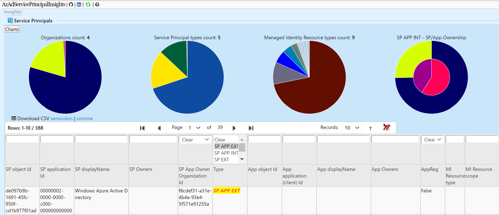
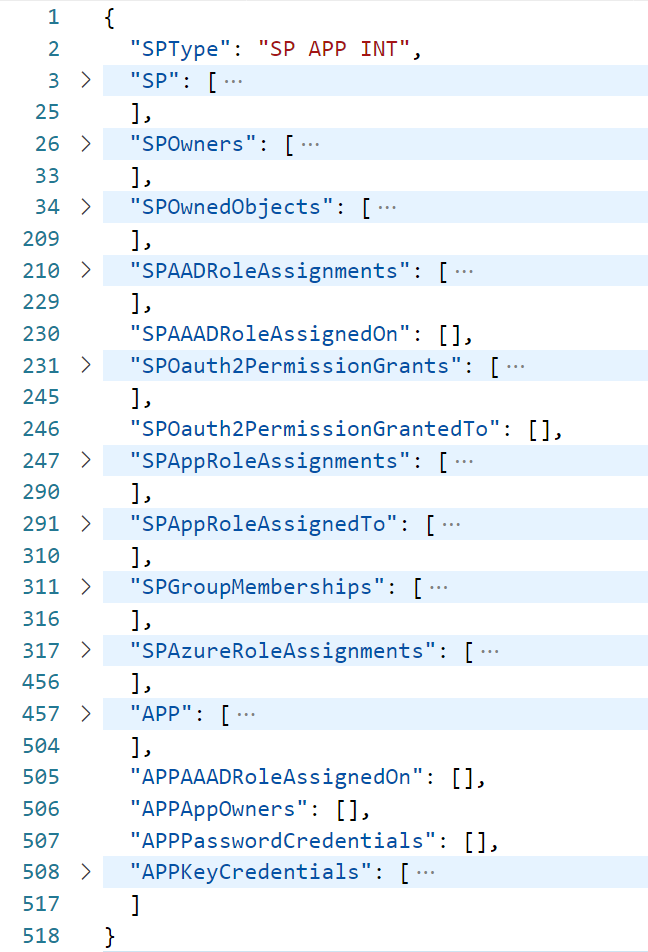

__AzADServicePrincipalInsights aka AzADSPI__

Insights and change tracking on Microsoft Entra ID Service Principals (Enterprise Applications and Applications)  

aka links:
* aka.ms/AzADSPI  
* aka.ms/AzADServicePrincipalInsights

# Content
- [Content](#content)
- [References](#references)
- [Updates](#updates)
- [Features](#features)
- [Parameters](#parameters)
- [Data](#data)
- [Prerequisites](#prerequisites)
  - [Permissions](#permissions)
    - [Azure](#azure)
    - [Microsoft Entra ID](#microsoft-entra-id)
    - [Azure DevOps](#azure-devops)
  - [PowerShell](#powershell)
- [Execute as Service Principal / Application](#execute-as-service-principal--application)
- [Preview](#preview)
- [AzAdvertizer](#azadvertizer)
- [Azure Governance Visualizer aka AzGovViz](#azure-governance-visualizer-aka-azgovviz)
- [Closing Note](#closing-note)

# References

Checkout the Blog post by Thomas Naunheim [Microsoft Entra Workload ID - Lifecycle Management and Operational Monitoring](https://www.cloud-architekt.net/entra-workload-id-lifecycle-management-monitoring/). In the article Thomas walks you through the different lifecycle phases and other aspects for workload identities in your Microsoft Entra environment. Also referencing AzADServicePrincipalInsights as part of the toolset for comprehensive reporting on application and service principal objects in your Entra ID environment.

# Updates
* 20231218 - thanks @kaiaschulz
    * Fix scope of subscriptions to process. The ARM entities API may still return subscriptions that are meanwhile delted and therefore should not be processed in the data collection
    * Use [AzAPICall](https://aka.ms/AzAPICall) PowerShell module version 1.1.86
* 20231217
    * Fix for SP names that contain escapable characters
    * Update GitHub workflows to support webApp publishing thanks @RS-MPersson
    * Use [AzAPICall](https://aka.ms/AzAPICall) PowerShell module version 1.1.85
* 20231121 - thanks @cjtous1
    * HTML updates
        * Added `SPTags` & `AppTags` to the following tables:
            * Service Principals
            * Service Principal AAD RoleAssignments
            * Service Principal App RoleAssignments
            * Service Principal App RoleAssignedTo
            * Service Principal Oauth Permission grants
            * Service Principal Azure RoleAssignments
        * Added `AppNotes` to the Service Principals table
    * Added the following CSV file exports
        * Service Principals
        * Service Principal Owners
        * Application Owners
        * Service Principal Owned Objects
        * Service Principal AAD RoleAssignments
        * Service Principal AAD RoleAssignedOn
        * Service Principal App RoleAssignedTo
        * Service Principal App RoleAssignments
        * Service Principal Azure RoleAssignments
        * Service Principal Group memberships
    * Fix: `NoCsvExport` is now working and preventing CSV files from being generated if true.
    * Fix: `NoJsonExport` is now working and preventing JSON files from being generated if true.
    * Use [AzAPICall](https://aka.ms/AzAPICall) PowerShell module version 1.1.84
* 20231001
    * fix hardcoded delimiter for export-csv - thanks @cjtous1
* 20230316
    * Use [AzAPICall](https://aka.ms/AzAPICall) PowerShell module version 1.1.70
* 20221017
    * Use [AzAPICall](https://aka.ms/AzAPICall) PowerShell module version 1.1.40
        * Issue #10 - Handle error `404` User Assigned Managed Identity / ResourceGroup not found  
* 20221014
    * Use [AzAPICall](https://aka.ms/AzAPICall) PowerShell module version 1.1.38 
        * Handle error `405` [Support for federated identity credentials not enabled](https://learn.microsoft.com/en-us/azure/active-directory/develop/workload-identity-federation-considerations#errors)
* 20221008
    * New feature - Managed Identity User Assigned Federated Identity Credentials
    * Rearrange JSON output for Managed Identity associated Azure Resources
* 20221007
    * New feature - Managed Identity User Assigned associated Azure Resources
    * Changed parameter name `NoAzureRoleAssignments` to `NoAzureResourceSideRelations`
        * Using `NoAzureResourceSideRelations`:
            * No (Azure Resource side) RBAC Role assignments collection
            * No (Azure Resource side) Policy assignments collection
            * No (Azure Resource side) Resources collection ('Managed Identity User Assigned associated Azure Resources' feature annul)
    * Azure DevOps pipeline yml - update vmImage ~~ubuntu-20.04~~ ubuntu-22.04
    * Minor fixes and optimizations
    * Use [AzAPICall](https://aka.ms/AzAPICall) PowerShell module version 1.1.33 
* 20220717
    * Removed identity governance state validation
    * Use AzAPICall PowerShell module version 1.1.18  
* 20220630
    * __Breaking Change__ on the Azure side: Instead of __RoleManagement.Read.All__ we require __RoleManagement.Read.Directory__
* 20220622_1
    * Fix `/providers/Microsoft.Authorization/roleAssignmentScheduleInstances` AzAPICall errorhandling (error 400, 500)
    * Optimize procedure to update the AzAPICall module
    * Use AzAPICall PowerShell module version 1.1.17
* 20220613_1
    * use AzAPICall module version 1.1.16
    * enhance HiPo Users HTML output
    * minor fixes
* 20220609_1
    * add parameter `-CriticalAADRoles` (defaults: Global Administrator, Privileged Role Administrator, Privileged Authentication Administrator)
    * add HiPo Users - A HiPo User has direct or indirect ownership on a ServicePrincipal(s) with classified permissions (AppRole, AAD Role, Azure Role, OAuthPermissionGrant)
    * use AzAPICall module version 1.1.13
    * minor fixes
* 20220505_1
    * fix: `using:scriptPath` variable in foreach parallel (this is only relevant for Azure DevOps and GitHub if you have a non default folder structure in your repository) - thanks Matt :)
* 20220501_1
    * parameter `-ManagementGroupId` accepts multiple Management Groups in form of an array e.g. `.\pwsh\AzADServicePrincipalInsights.ps1 -ManagementGroupId @('mgId0', 'mgId1')`
    * new parameter `-OnlyProcessSPsThatHaveARoleAssignmentInTheRelevantMGScopes`. You may want to only report on Service Principals that have RBAC permissions on Azure resources at and below that Management Group scope(s) (Management Groups, Subscriptions, Resource Groups and Resources)
    * Role assignments on Azure resources - mark those RBAC Role assignments which leverage a RBAC Role definition that can create role assignments as critical
    * updated YAML workflow/pipeline files
    * minor bug fixes
    * performance optimization
* 20220425_2
    * add parameter `-ManagementGroupId` (if undefined, then Tenant Root Management Group will be used)
    * use AzAPICall module version 1.1.11
* 20220404_1 
    * add FederatedIdentityCredentials

# Features

* HTML export
* JSON export
* CSV export (wip)
  * AADRoleAssignments
  * AppRoleAssignments
  * Oauth2PermissionGrants
  * AppSecrets
  * AppCertificates
  * AppFederatedIdentityCredentials
  * MIFederatedIdentityCredentials
  * MI User Assigned associated resources
* Customizable permission classification (permissionClassification.json)
  * sources/resources
    * https://m365internals.com/2021/07/24/everything-about-service-principals-applications-and-api-permissions/ -> What applications are considered critical?
    * https://docs.microsoft.com/en-us/security/compass/incident-response-playbook-app-consent#classifying-risky-permissions -> Classifying risky permissions   
    * https://www.youtube.com/watch?v=T-ZnAUt1IP8 -> Monitoring and Incident Response in Azure AD

# Parameters

* `DebugAzAPICall` - Switch to enable AzAPICall debug function for troubleshooting API calls using the AzAPICall module
* `ManagementGroupId` 
   * Option1: The Management Group ID that should be queried for the report. If undefined the Root Management group will be used.
   * Option2: accepts multiple Management Groups in form of an array e.g. .\pwsh\AzADServicePrincipalInsights.ps1 -ManagementGroupId @('mgId0', 'mgId1')
* `NoCsvExport`  - Switch to disable exporting enriched data in CSV format
* `CsvDelimiter` - The world is split into two kinds of delimiters - comma and semicolon - choose yours (default : ';')
* `OutputPath` - Define the path where you want the output files to be stored
* `SubscriptionQuotaIdWhitelist` - Process only Subscriptions with defined QuotaId(s). Example: .\AzADServicePrincipalInsights.ps1 -SubscriptionQuotaIdWhitelist MSDN_,Enterprise_ (default : @('undefined')
* `DoTranscript` - Switch to enable logging to console output
* `HtmlTableRowsLimit` Threshold for the HTML output (table formatted) to prevent unresponsive browser issue due to limited client device performance. A recommendation will be shown to download the CSV instead of opening the TF table (default : 20000)
* `ThrottleLimitARM` - Limit the parallel Azure Resource Manager API requests (default : 10)
* `ThrottleLimitGraph` - Limit the parallel Graph API requests (default : 20)
* `ThrottleLimitLocal` - Limit the parallelism of Powershell task to process the results (default : 100)
* `SubscriptionId4AzContext` - If needed set a specific SubscriptionID as context for the AzAPICall module (default : 'undefined')
* `FileTimeStampFormat` - Define the time format for the output files (default : 'yyyyMMdd_HHmmss')
* `NoJsonExport` - Switch to disable exporting enriched data in Json formatted files
* `AADGroupMembersLimit` - Defines the limit of AAD Group members; For AAD Groups that have more members than the defined limit Group members will not be resolved (default : 500)
* `NoAzureResourceSideRelations` - Switch to disable the processing of Azure resource side relations 
* `StatsOptOut` - Switch to opt out sending statistics for usage analysis
* `ApplicationSecretExpiryWarning` - Define warning period for Service Principal secret expiry (default : 14 days)
* `ApplicationSecretExpiryMax` - Define maximum expiry period for Service Principal secrets (default : 730 days)
* `ApplicationCertificateExpiryWarning` - Define warning period for Service Principal certificate expiry (default : 14 days)
* `ApplicationCertificateExpiryMax` - Define maximum expiry period for Service Principal certificates (default : 730 days)
* `DirectorySeparatorChar` - Set the character for directory seperation (default : [IO.Path]::DirectorySeparatorChar)
* `OnlyProcessSPsThatHaveARoleAssignmentInTheRelevantMGScopes` - Switch to only report on Service Principals that have a role assigment within the scope of the data  collection contaxt
* `CriticalAADRoles` - Microsoft Entra ID roles that should be considered as highly privileged/critical (default :@('62e90394-69f5-4237-9190-012177145e10', 'e8611ab8-c189-46e8-94e1-60213ab1f814', '7be44c8a-adaf-4e2a-84d6-ab2649e08a13') which are Global Administrator, Privileged Role Administrator, Privileged Authentication Administrator)

# Data

* ServicePrincipals by type
* ServicePrincipal  owners
* Application owners
* ServicePrincipal owned objects
* Managed Identity User Assigned - associated Azure Resources
* ServicePrincipal  AAD Role assignments
* ServicePrincipal AAD Role assignedOn
* Application AAD Role assignedOn
* App Role assignments (API permissions Application)
* App Roles assignedTo (Users and Groups)
* Oauth permission grants (API permissions delegated)
* Azure Role assignments (Azure Resources; Management Groups, Subscriptions, Resource Groups, Resources)
* ServicePrincipal Group memberships
* Application Secrets
* Application Certificates
* Application Federated Identity Credentials
* Managed Identity User Assigned Federated Identity Credentials
* HiPo Users (wip)

# Prerequisites

## Permissions

### Azure

Management Group (Tenant Root Management Group) RBAC: __Reader__

### Microsoft Entra ID

Microsoft Graph API | Application | __Application.Read.All__  
Microsoft Graph API | Application | __Group.Read.All__  
~~Microsoft Graph API | Application | __RoleManagement.Read.All__~~  
Microsoft Graph API | Application | __RoleManagement.Read.Directory__  
Microsoft Graph API | Application | __User.Read.All__

### Azure DevOps

The Build Service Account or Project Collection Build Service Account (which ever you use) requires __Contribute__ permissions on the repository (Project settings - Repos - Security)

## PowerShell
Requires PowerShell Version >= 7.0.3

Requires PowerShell Module 'AzAPICall'.  
Running in Azure DevOps or GitHub Actions the AzAPICall PowerShell module will be installed automatically.  
AzAPICall resources:

[](https://www.powershellgallery.com/packages/AzAPICall)  
[GitHub Repository](https://aka.ms/AzAPICall)

# Execute as Service Principal / Application

#USER: 'Application (client) ID' of the App registration OR 'Application ID' of the Service Principal (Enterprise Application)  
#PASSWORD: Secret of the App registration  

```
$pscredential = Get-Credential
Connect-AzAccount -ServicePrincipal -TenantId <tenantId> -Credential $pscredential
.\pwsh\AzADServicePrincipalInsights.ps1
```

# Preview

  
  


# AzAdvertizer


Also check <https://www.azadvertizer.net> - AzAdvertizer helps you to keep up with the pace by providing overview and insights on new releases and changes/updates for Azure Governance capabilities such as Azure Policy's Policy definitions, initiatives (Set definitions), aliases and Azure RBAC's Role definitions and resource provider operations.

# Azure Governance Visualizer aka AzGovViz


Also check out the [__Azure Governance Visualizer__](https://aka.ms/AzGovViz). The tool is intended to help you to get a holistic overview on your technical Azure Governance implementation by connecting the dots.  
It is a PowerShell script that iterates your Azure Tenant's Management Group hierarchy down to Subscription level, it captures most relevant Azure governance capabilities such as Azure Policy, RBAC and Blueprints and a lot more..
* Listed as [tool](https://docs.microsoft.com/en-us/azure/cloud-adoption-framework/reference/tools-templates#govern) for the Govern discipline in the Microsoft Cloud Adoption Framework (CAF)  
* Listed as [security monitoring tool](https://docs.microsoft.com/en-us/azure/architecture/framework/security/monitor-tools) in the Microsoft Well Architected Framework (WAF)

# Closing Note

Please note that while being developed by a Microsoft employee, AzADServicePrincipalInsights is not a Microsoft service or product. AzADServicePrincipalInsights is a personal/community driven project, there are none implicit or explicit obligations related to this project, it is provided 'as is' with no warranties and confer no rights.
